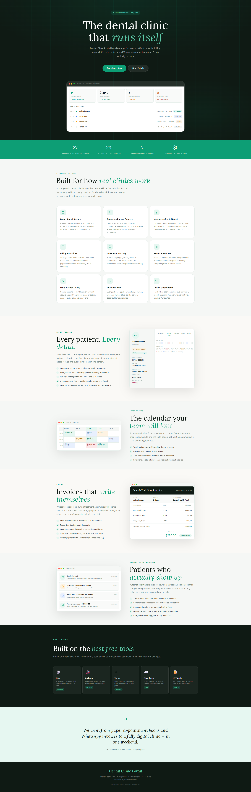

<div style="display: flex; align-items: center; gap: 16px; margin-bottom: 16px;">
  
  <div>
    <div style="display: flex; align-items: baseline; gap: 8px;">
      <span style="font-size: 20px; font-weight: 700; color: #F80000;">eALIF Team</span>
      <span style="font-size: 16px; font-weight: 500; color: #FC1D00;">Production</span>
    </div>
    <h1 style="margin: 4px 0 0; font-size: 28px; font-weight: 800; background: linear-gradient(135deg, #0d9e75, #6d28d9); -webkit-background-clip: text; -webkit-text-fill-color: transparent; background-clip: text;">
      Daryeel App — Multi-Clinic Dental SaaS Platform
    </h1>
  </div>
</div>

A complete SaaS platform for managing multiple dental clinics. Includes clinic management, subscription billing, super admin dashboard, role-based access control, and AI assistant.



## Tech Stack

| Layer      | Tech                          |
|------------|-------------------------------|
| Frontend   | React 18 + Vite + TypeScript  |
| Styling    | Tailwind CSS + Custom Design System |
| Routing    | React Router v6               |
| State      | Zustand + TanStack Query      |
| Backend    | Node.js + Express             |
| Database   | PostgreSQL (Neon)             |
| Auth       | JWT (access + refresh tokens) |
| Payments   | Stripe + Telesom + eDahab     |
| Storage    | Cloudinary                    |
| AI         | Google Gemini                 |
| Toasts     | react-hot-toast               |
| Icons      | lucide-react                  |

---

## 🚀 Getting Started

### 1. Install dependencies

```bash
# Backend
cd backend
npm install

# Frontend
cd Front_End
npm install
```

### 2. Configure Environment Variables

**Backend (`backend/.env`):**
```env
NODE_ENV=development
PORT=3000
FRONTEND_URL=http://localhost:5173

# Database (Neon PostgreSQL)
DATABASE_URL=postgresql://...

# JWT Secrets (generate with crypto.randomBytes)
JWT_SECRET=...
JWT_REFRESH_SECRET=...

# Stripe
STRIPE_SECRET_KEY=sk_test_...
STRIPE_PUBLISHABLE_KEY=pk_test_...
STRIPE_WEBHOOK_SECRET=whsec_...

# Cloudinary
CLOUDINARY_CLOUD_NAME=...
CLOUDINARY_API_KEY=...
CLOUDINARY_API_SECRET=...

# Email (Gmail SMTP)
SMTP_HOST=smtp.gmail.com
SMTP_PORT=587
SMTP_USER=...
SMTP_PASS=...

# SaaS Settings
TRIAL_DAYS=14
DEFAULT_PLAN=basic

# Telesom SMS
TELESOM_SENDER_ID=...
TELESOM_USERNAME=...
TELESOM_PASSWORD=...

# eDahab
EDAHAB_API_URL=https://api.edahab.net/v1
EDAHAB_MERCHANT_ID=...
EDAHAB_API_KEY=...
```

**Frontend (`Front_End/.env`):**
```env
VITE_API_URL=http://localhost:3000
VITE_APP_NAME=Dental Clinic Portal
VITE_STRIPE_PUBLISHABLE_KEY=pk_test_...
VITE_GEMINI_API_KEY=...  # Optional AI assistant
```

### 3. Run Database Migrations

Execute the SQL scripts in `backend/migrations/` to create all required tables:

- `clinics` — Clinic records
- `clinic_subscriptions` — Subscription status per clinic
- `subscription_plans` — Available plans (Basic, Professional, Enterprise)
- `subscription_invoices` — Billing history
- `users` — Staff and admin accounts
- `patients`, `appointments`, `treatments`, `prescriptions`
- `inventory_items`, `lab_orders`
- `support_tickets`, `feature_requests`, `audit_logs`
- `platform_settings`, `clinic_settings`

### 4. Create Super Admin User

```sql
INSERT INTO users (email, password_hash, full_name, role, is_active, created_at)
VALUES ('admin@dentiflow.com', '$2b$10$...', 'Super Admin', 'super_admin', true, NOW());
```

### 5. Start the servers

```bash
# Backend (from /backend)
npx nodemon src/server.js

# Frontend (from /Front_End)
npm run dev
```

Access the app at `http://localhost:5173`

---

## 📁 Project Structure

```
App/
├── backend/
│   ├── src/
│   │   ├── api/v1/
│   │   │   ├── routes/        # Express routes (auth, clinics, admin, etc.)
│   │   │   ├── controllers/   # Request handlers
│   │   │   └── middlewares/   # Auth, validation
│   │   ├── services/          # Business logic
│   │   ├── db/                # PostgreSQL pool
│   │   └── utils/             # Helpers (asyncHandler, auditLogger, etc.)
│   ├── migrations/            # SQL migration files
│   ├── scripts/               # Utility scripts
│   └── server.js              # Entry point
│
└── Front_End/
    ├── src/
    │   ├── app/               # Zustand stores (auth, UI)
    │   ├── api/               # Axios client + API calls
    │   ├── pages/             # All route pages
    │   │   ├── admin/         # Clinic admin pages
    │   │   ├── superAdmin/    # Platform super admin pages
    │   │   ├── Doctor/        # Dentist portal
    │   │   ├── receptionist/  # Receptionist portal
    │   │   ├── Assistant/     # Dental assistant portal
    │   │   └── accountent/    # Accountant portal
    │   ├── layouts/           # DashboardLayout, SuperAdminLayout, etc.
    │   ├── components/        # Reusable UI components
    │   ├── ai/                # Gemini AI assistant with function calling
    │   ├── utils/             # Formatting helpers
    │   └── styles/            # Global CSS
    └── public/
```

---

## ✅ Features (Current)

### Platform (Super Admin)
- [x] Dashboard with KPIs (clinics, revenue, patients)
- [x] Clinic Management (CRUD, approve/reject, suspend/activate)
- [x] Subscription Plans (Basic, Professional, Enterprise)
- [x] Billing & Invoices (Stripe integration)
- [x] Payment History
- [x] Platform Users Management
- [x] Feature Requests Tracking
- [x] Support Tickets
- [x] Audit Logs / Activity Log
- [x] Usage Metrics & Analytics
- [x] Pending Clinic Approvals

### Clinic Admin
- [x] Patient Management (CRUD, search)
- [x] Appointment Scheduling (calendar, status management)
- [x] Treatment Records
- [x] Prescriptions
- [x] Lab Orders
- [x] Inventory Management
- [x] Staff Management
- [x] Billing & Invoicing
- [x] Reports & Analytics
- [x] Notifications (in-app, email, SMS)

### Role-Based Access
- [x] Super Admin (platform owner)
- [x] Admin (clinic owner)
- [x] Dentist
- [x] Receptionist
- [x] Assistant
- [x] Accountant

### Additional
- [x] JWT Authentication with refresh tokens
- [x] Subscription limits enforcement
- [x] Telesom SMS integration
- [x] Cloudinary file uploads
- [x] AI Assistant (Gemini) with function calling
- [x] Dark collapsible sidebar
- [x] Responsive design
- [x] Firebase Authentication (legacy support)

---

## 🔹 Planned / In Progress

- [ ] eDahab mobile money integration (partial)
- [ ] Advanced analytics dashboard
- [ ] Patient portal
- [ ] Mobile app
- [ ] PDF report export
- [ ] File management for X-rays

---

## TypeScript Notes

- `strict: false` — no type errors will block development
- `noImplicitAny: false` — `any` is allowed
- No ESLint — clean, fast development

---

## 📜 License

**Daryeel** is proprietary software developed and owned by **eALIF Team Solutions**. All rights reserved.

### Terms of Use

This software is licensed, not sold. By accessing or using the platform, you agree to the following:

- ✅ **Permitted Use**: Authorized clinics and their staff may use the platform for legitimate dental practice management purposes.
- ❌ **Restrictions**: You may not copy, modify, distribute, sell, sublicense, reverse engineer, or create derivative works of the software without explicit written permission.
- 🔒 **Confidentiality**: All patient data, clinic information, and platform metrics remain the property of the respective clinic and are protected under applicable data protection laws.
- ⚖️ **Liability**: The software is provided "as is" without warranty of any kind. eALIF Team Solutions is not liable for any damages arising from the use or inability to use the platform.

### Source Code Access

Source code is provided exclusively to paying enterprise customers under a separate **Enterprise License Agreement (ELA)**. For inquiries about source code access or custom deployments, contact:

📧 **legal@ealifteam.so**

---

*© 2025–2026 eALIF Team Solutions. All rights reserved. Unauthorized reproduction or distribution is strictly prohibited.*